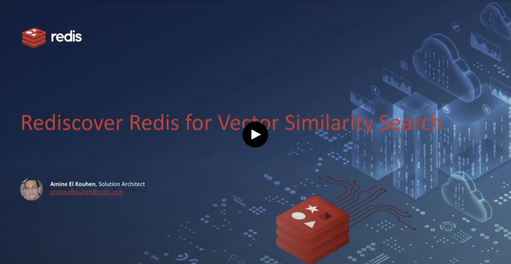
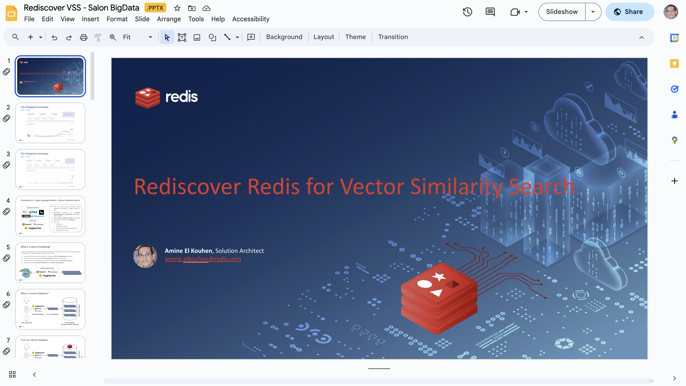

# Rediscover Redis for Vector Similarity Search
Redis Vector Similarity Search Workshop Materials.

## Shared Materials

<table>
    <tr>
        <td> Video Tutorial (FR) </td> 
        <td width="50%"> Slides Deck </td> 
    </tr>
</table>

## Table of Contents

* [Pre-requisites](#Pre-requisites)
* [Text Vector Search](#demo-1-text-vector-search-)
* [Visual Vector Search](#demo-2-visual-vector-search-)
* [Hybrid Search](#demo-2bis-hybrid-search-)
* [Semantic Search](#demo-3-semantic-search-)
* [Retieval-Augmented Generation](#demo-4-retieval-augmented-generation-rag-)

## Pre-requisites
You need to create a Redis Enterprise DB with `RedisJSON` and `RediSearch` modules. Then, Use the public endpoint in the notebooks.

To create a Redis Enterprise database, you can use [Redis Cloud](https://app.redislabs.com/) or you can provision a cluster in your own infrastructure using [TerrAmine](https://github.com/amineelkouhen/terramine).

## Demo 1: Text Vector Search  

In this demo, you will learn how to:
- Create vector embeddings for text,
- Persist vector integrations in Redis,
- Create a Secondary Search Index on these Vectors,
- Find similarity between a new vector (text) and already persisted vectors.

## Demo 2: Visual Vector Search  

In this second demo, you will learn how to:
- Create vector embeddings for products (by image),
- Persist vector embeddings in Redis,
- Create a Secondary Search Index on these Vectors,
- Find similarity between a new vector (image) and the already persisted vectors.

## Demo 2bis: Hybrid Search 

In this demo, you will learn how to:
- Create vector embeddings for products (by image),
- Persist JSON documents containing the vector embeddings and other fields (e.g., tag, location, price...) in Redis,
- Create a Secondary Search Index on these documents,
- Find similarity between a new vector (image) and the already persisted vectors.
- Search for similarity between a new vector (image) and already persisted vectors, pre-filtered by a tag, a location, or a price range.

## Demo 3: Semantic Search 

In this demo, you will learn how to:
- Create vector embeddings for a private knowledge base (e.g., White papers, blog posts, newsletters...),
- Persist vector embeddings in Redis,
- Create a Secondary Search Index on these Vectors,
- Search semantically (natural language) for the already persisted vectors (relevant resources),
- Use Redis as a semantic cache.

## Demo 4: Retieval-Augmented Generation (RAG) .ipynb)

In this last demo, you will learn how to:
- Create vector embeddings for a private knowledge base (e.g., PDF files, blogs posts, Database),
- Persist vector embeddings in Redis,
- Create a Secondary Search Index on these Vectors,
- Search semantically (natural language) for the already persisted vectors (relevant resources),
- Use relevant resources as a prompt context for LLM conversation,
- Generate an augmented response (natural language),
- Use Redis as a standard cache,
- Use Redis as a semantic cache,
- Use Redis as Q/A history.

